**English** | [日本語](README.ja.md)

# Prism Zero

Color themes for editors and terminals, based on [PrismJS](https://prismjs.com/) syntax colors (adjusted for UI chrome and dark backgrounds). Light and Dark appearances are included.

Supported: Visual Studio Code, Cursor, Panic Nova, Neovim, Typora, iTerm 2, Prompt 3, Ptyxis, Windows Terminal.

## Screenshots

### Cursor

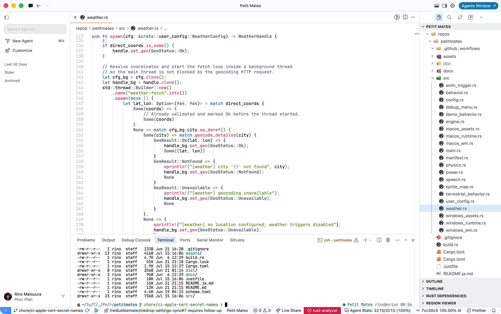

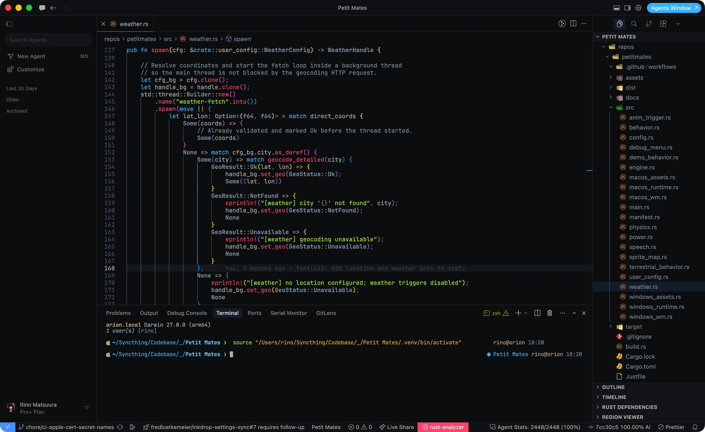

### Visual Studio Code

| Light                                                                    | Dark                                                                   |
| ------------------------------------------------------------------------ | ---------------------------------------------------------------------- |
| 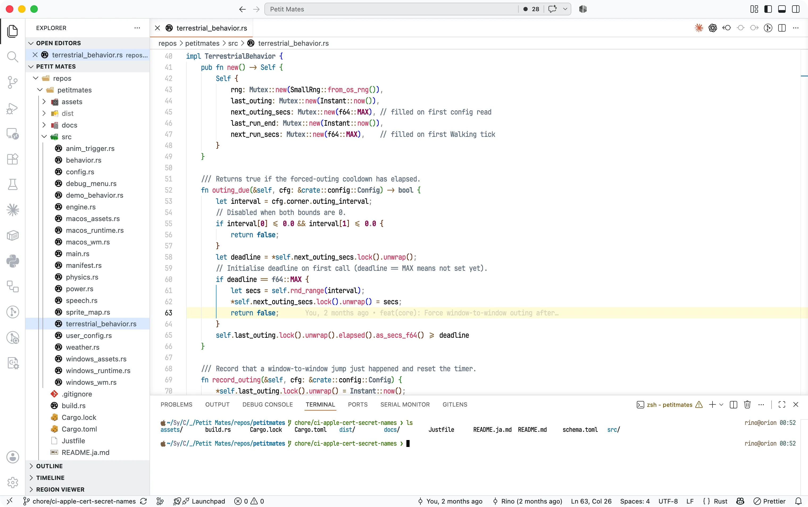 | 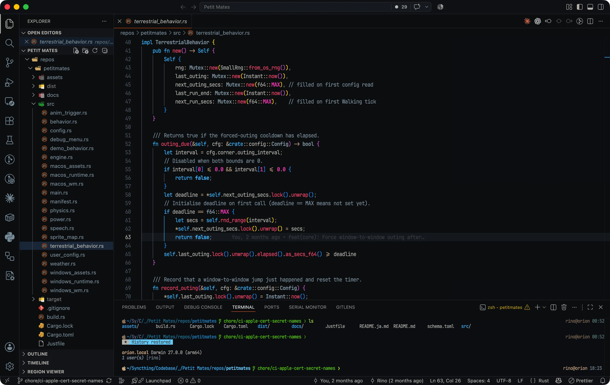 |

### Panic Nova

| Light                                                          | Dark                                                         |
| -------------------------------------------------------------- | ------------------------------------------------------------ |
| 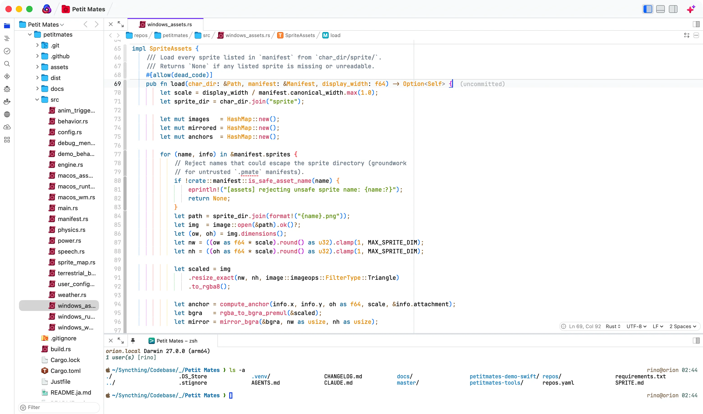 | 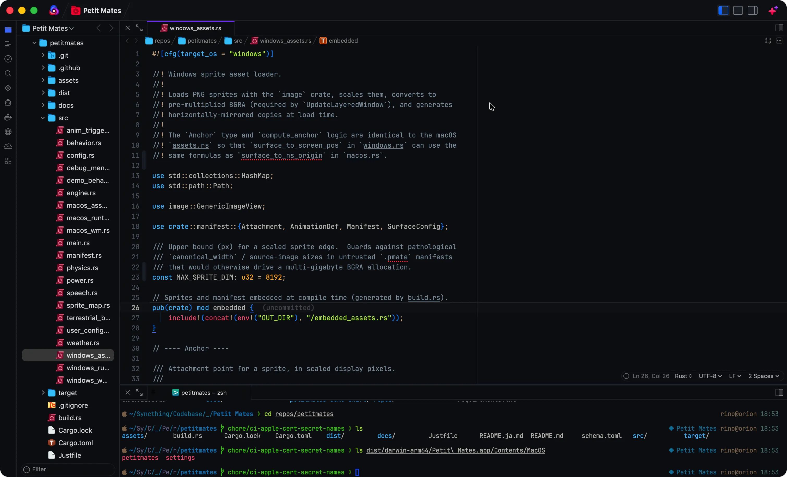 |

### Neovim

| Light                                                        | Dark                                                       |
| ------------------------------------------------------------ | ---------------------------------------------------------- |
| 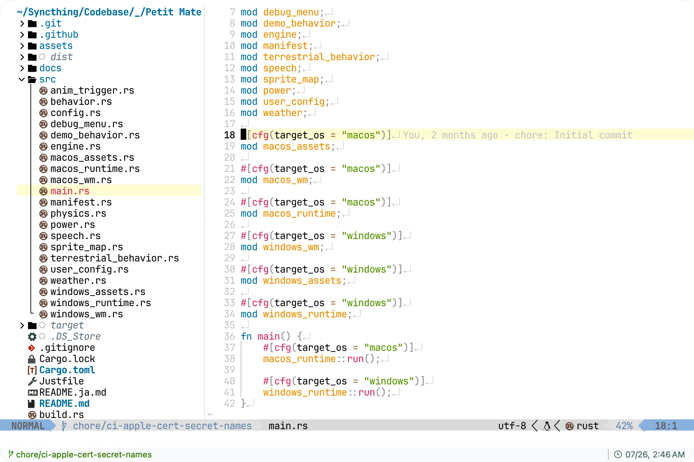 | 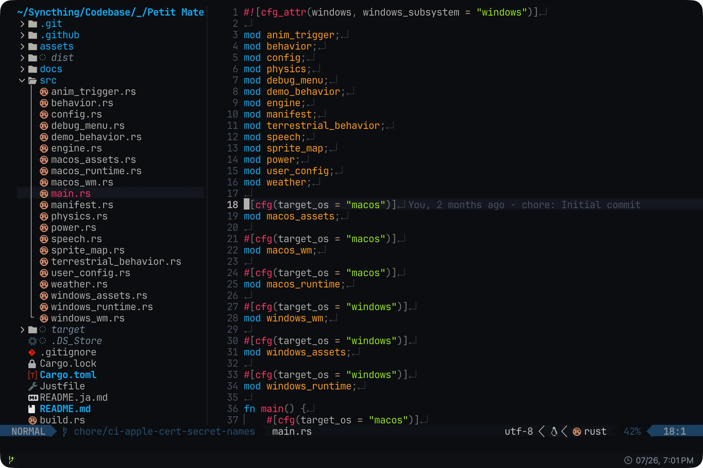 |

### iTerm 2

| Light                                                        | Dark                                                       |
| ------------------------------------------------------------ | ---------------------------------------------------------- |
| 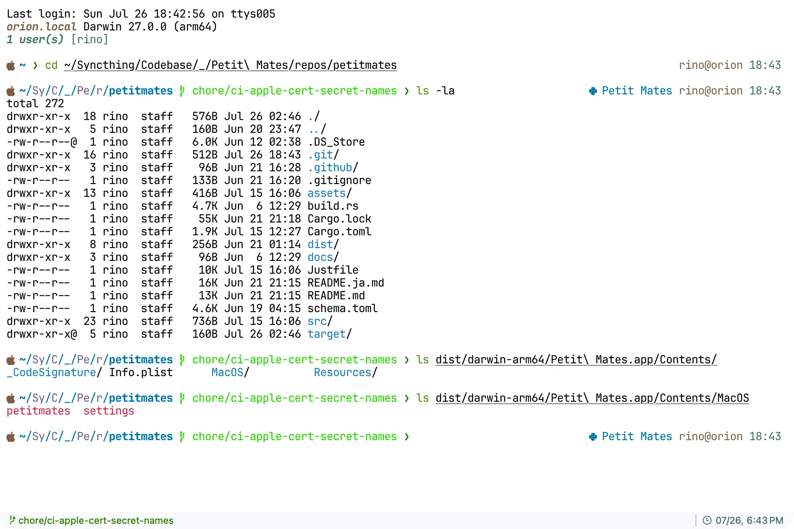 | 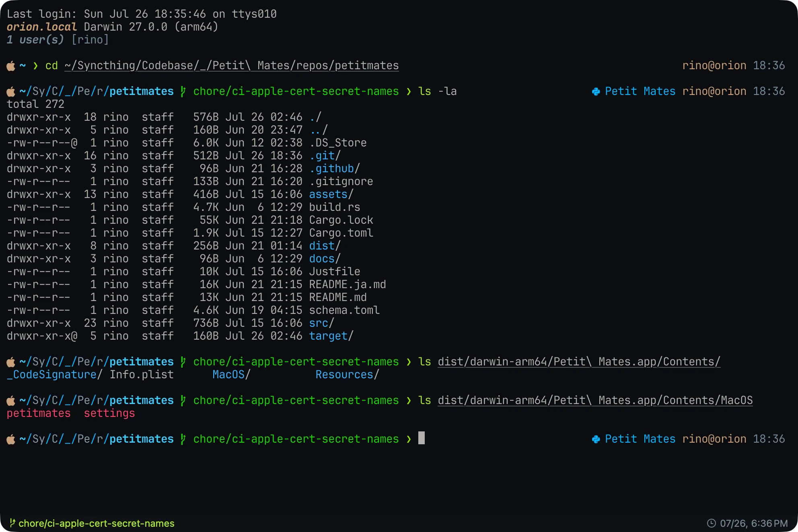 |

### Prompt 3

| Light                                                          | Dark                                                         |
| -------------------------------------------------------------- | ------------------------------------------------------------ |
| 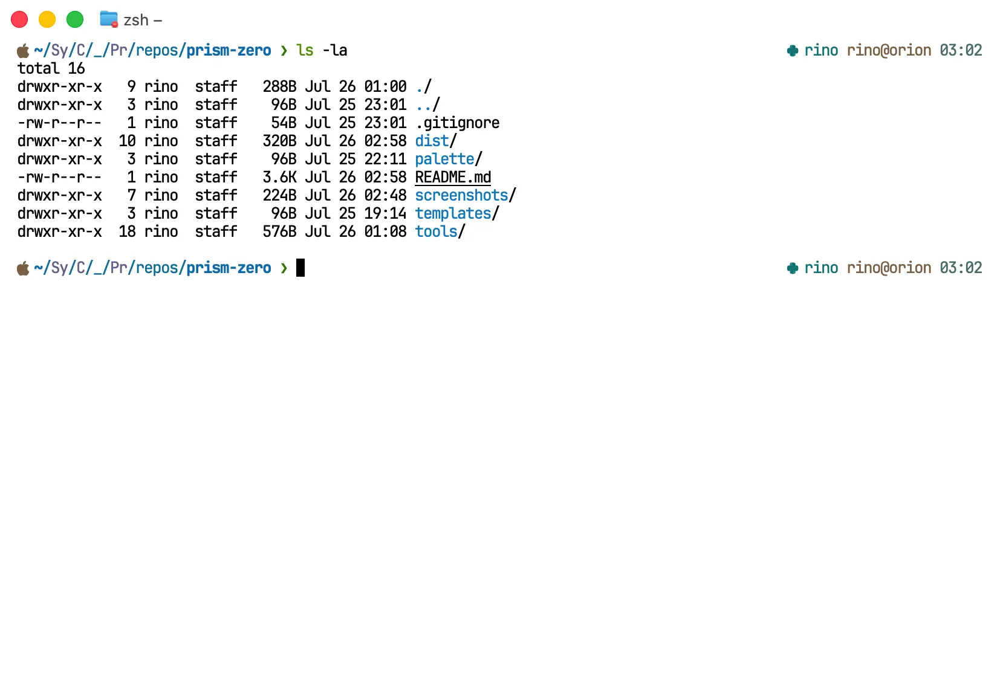 | 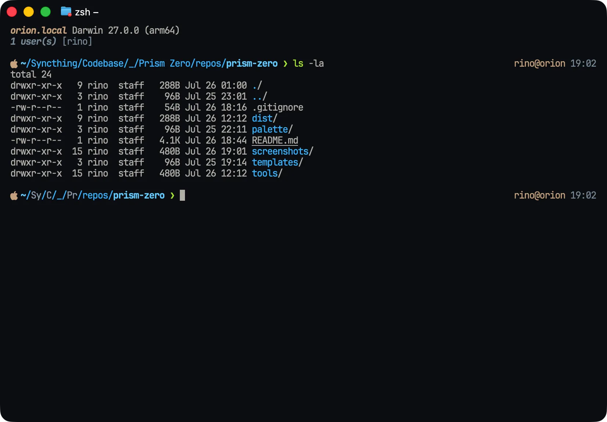 |

### Ptyxis

| Light                                                        | Dark                                                       |
| ------------------------------------------------------------ | ---------------------------------------------------------- |
| 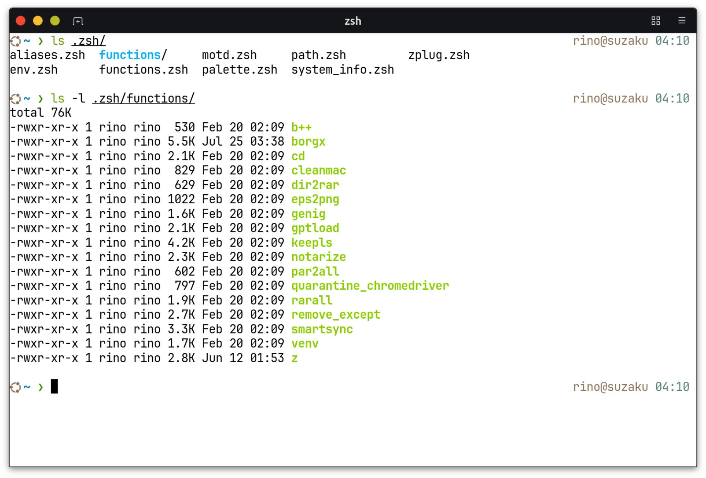 | 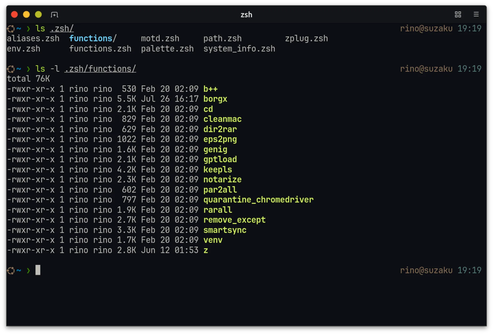 |

### Windows Terminal

| Light                                                                            | Dark                                                                           |
| -------------------------------------------------------------------------------- | ------------------------------------------------------------------------------ |
| 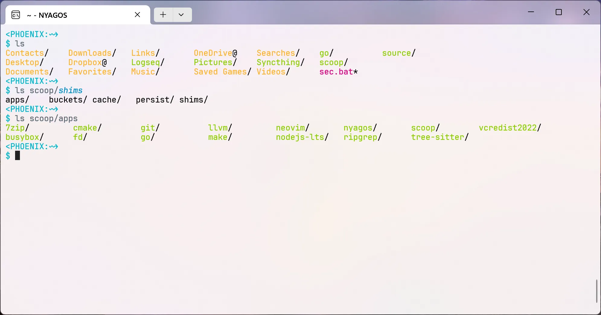 | 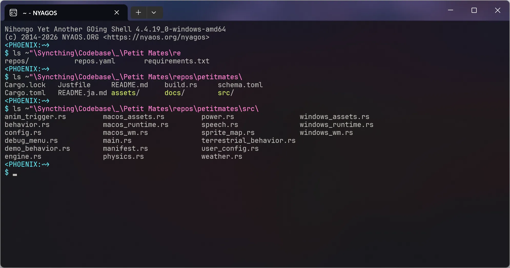 |

## Install

### Visual Studio Code / Cursor

Install **Prism Zero** from the Marketplace, then select **Prism Zero Light** or **Prism Zero Dark** in the Color Theme picker.

If the Marketplace is unavailable (for example code-server), download the latest `.vsix` from the repository Releases page and run:

```bash
code --install-extension prism-zero-*.vsix
# or: cursor --install-extension prism-zero-*.vsix
```

### Panic Nova

Install **Prism Zero** from Nova’s Extension Library (Extensions → Extension Library, or [extensions.panic.com](https://extensions.panic.com/)), then select **Prism Zero Light** or **Prism Zero Dark** in Themes.

Without the Library, open or copy [`dist/nova/Prism Zero.novaextension`](dist/nova/Prism%20Zero.novaextension) into Nova.

### Quick install (Neovim / Ptyxis)

On macOS or Linux, a small script copies theme files only for **detected** apps (Neovim and/or Ptyxis). It does **not** install Marketplace extensions (VS Code, Cursor, Nova) and does **not** apply iTerm / Prompt profiles.

From a clone:

```bash
sh install.sh
```

Or (after this repository is on GitHub):

```bash
curl -fsSL https://raw.githubusercontent.com/rinodrops/prism-zero/main/install.sh | sh
```

iTerm 2 and Prompt 3 stay manual import; the script prints `curl` download commands. Windows Terminal has its own script below.

### Typora

Copy [`dist/typora/prism-zero-light.css`](dist/typora/prism-zero-light.css) and/or [`prism-zero-dark.css`](dist/typora/prism-zero-dark.css) into Typora’s theme folder (Preferences → Appearance → Open Theme Folder), restart Typora if needed, then choose **Prism Zero Light** or **Prism Zero Dark** from the Themes menu.

Filenames must stay lowercase with hyphens only (Typora requirement).

### Neovim

The installer above places both colorschemes when Neovim is detected. Manually:

Copy [`dist/nvim/prism_zero_light.lua`](dist/nvim/prism_zero_light.lua) and [`prism_zero_dark.lua`](dist/nvim/prism_zero_dark.lua) into `~/.config/nvim/colors/`, then:

```vim
:colorscheme prism_zero_light
" or
:colorscheme prism_zero_dark
```

Plugin layout (optional): [`dist/nvim/prism-zero.nvim/`](dist/nvim/prism-zero.nvim/).

### iTerm 2

Download a preset, then import it and apply it to your profile:

```bash
mkdir -p ~/Downloads
curl -fsSL -o ~/Downloads/"Prism Zero Light.itermcolors" \
  https://raw.githubusercontent.com/rinodrops/prism-zero/main/dist/iterm/Prism%20Zero%20Light.itermcolors
# or Dark:
curl -fsSL -o ~/Downloads/"Prism Zero Dark.itermcolors" \
  https://raw.githubusercontent.com/rinodrops/prism-zero/main/dist/iterm/Prism%20Zero%20Dark.itermcolors
```

iTerm 2: Profiles → Colors → Color Presets… → Import, then select the preset.

From a clone, you can also import [`dist/iterm/Prism Zero Light.itermcolors`](dist/iterm/Prism%20Zero%20Light.itermcolors) or [`Prism Zero Dark.itermcolors`](dist/iterm/Prism%20Zero%20Dark.itermcolors) directly.

### Prompt 3

Import the same iTerm presets via Settings → Themes (gear → Import).

### Ptyxis

The installer above copies palettes when Ptyxis is detected. Manually:

Copy [`Prism Zero Light.palette`](dist/ptyxis/Prism%20Zero%20Light.palette) or [`Dark`](dist/ptyxis/Prism%20Zero%20Dark.palette) to `~/.local/share/org.gnome.Ptyxis/palettes/` (Flatpak: app data `…/org.gnome.Ptyxis/palettes/`), then choose the palette in Preferences → Appearance.

Note: Ptyxis always draws bold text using the bright ANSI colors; that mapping is not configurable.

### Windows Terminal

From a clone (recommended):

```powershell
pwsh -File .\install-windows-terminal.ps1
# optional: also set the default profile scheme
pwsh -File .\install-windows-terminal.ps1 -SetActiveScheme Dark
```

The script backs up `settings.json`, then upserts the **Prism Zero Light** and **Prism Zero Dark** entries into `schemes`. By default it does not change profile `colorScheme` (pass `-SetActiveScheme Light|Dark` to set the default profile).

If `settings.json` is non-standard, pass `-SettingsPath` or set `WINDOWS_TERMINAL_SETTINGS`.

Manual merge: copy a `schemes` entry from [`prism-zero-light.json`](dist/windows-terminal/prism-zero-light.json) or [`prism-zero-dark.json`](dist/windows-terminal/prism-zero-dark.json) into your `settings.json`, then set the profile `colorScheme`.

## License

MIT — Copyright (c) Rino, eMotionGraphics Inc.

## Changelog

### 1.1.0

- Align package version with Prism Zero 1.1.0
- Document Typora among supported apps in the Extension README

### 1.0.0

- Initial release
